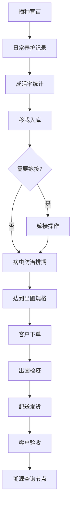

# 珍稀苗木种植基地管理系统 - 产品需求文档

## 1. 产品概述
珍稀苗木种植基地管理系统是一套面向苗木种植企业的全流程数字化管理平台，覆盖从育苗、嫁接、病虫防治到出圃销售、客户服务的完整业务链路。
- 解决传统苗圃管理数据分散、追溯困难、效率低下的痛点，实现苗木全生命周期可视化管理
- 面向苗圃管理者、技术人员、销售人员及客户，提升运营效率与品牌可信度

## 2. 核心功能

### 2.1 用户角色
| 角色 | 注册方式 | 核心权限 |
|------|---------|---------|
| 系统管理员 | 后台创建 | 全部功能权限、用户管理、系统配置 |
| 苗圃管理员 | 后台创建 | 苗木台账、育苗、嫁接、防治、出圃、客户管理全功能 |
| 技术人员 | 后台创建 | 育苗记录、嫁接操作、病虫防治录入 |
| 销售人员 | 后台创建 | 出圃销售、客户管理、订单处理 |
| 客户/公众 | 自主访问 | 溯源查询、苗木信息浏览 |

### 2.2 功能模块
1. **苗木台账**：苗木品种档案、苗木规格分级、库存总览
2. **育苗管理**：播种育苗批次、成活率统计、移栽养护指导
3. **嫁接记录**：嫁接组合档案、嫁接批次记录、嫁接成活率统计
4. **病虫防治**：病虫害档案、防治排期日历、用药记录追踪
5. **出圃销售**：出圃检疫、绿化工程供苗、销售台账
6. **客户管理**：客户档案、客户订单、联系记录
7. **溯源查询**：苗木去向溯源、全生命周期查询

### 2.3 页面详情
| 页面名称 | 模块名称 | 功能描述 |
|---------|---------|-----------|
| 苗木台账 | 品种档案卡片 | 展示苗木学名、别名、科属、产地、生长习性、图片 |
| 苗木台账 | 规格分级表 | 地径/胸径/高度/冠幅分级标准与对应库存数量 |
| 苗木台账 | 库存统计看板 | 按品种、区域、状态统计库存，可视化图表展示 |
| 育苗管理 | 播种批次列表 | 批次号、品种、播种日期、数量、温室位置、负责人 |
| 育苗管理 | 成活率统计 | 各批次发芽率、成活率折线图与对比柱状图 |
| 育苗管理 | 移栽养护指南 | 分阶段养护要点、浇水施肥周期、注意事项 |
| 嫁接记录 | 嫁接组合档案 | 砧木+接穗组合、亲和性评级、技术要点 |
| 嫁接记录 | 嫁接操作日志 | 嫁接日期、操作人员、数量、方法（枝接/芽接） |
| 嫁接记录 | 成活分析 | 按组合、方法、时间维度的成活率统计图表 |
| 病虫防治 | 病虫害图鉴 | 病害/虫害名称、症状描述、配图、防治方法 |
| 病虫防治 | 防治排期日历 | 月度防治计划、预警提醒、已完成/待办状态 |
| 病虫防治 | 用药记录 | 农药名称、配比、施用日期、操作人员、安全间隔期 |
| 出圃销售 | 出圃检疫 | 检疫单号、检疫结果、出圃日期、苗木批次、证书 |
| 出圃销售 | 工程供苗 | 项目名称、供苗清单、交货进度、现场照片 |
| 出圃销售 | 销售台账 | 订单流水、金额统计、回款状态、发票信息 |
| 客户管理 | 客户档案 | 企业/个人信息、类型、等级、合作历史、联系人 |
| 客户管理 | 订单管理 | 下单、发货、验收、开票全流程追踪 |
| 客户管理 | 联系记录 | 沟通日志、跟进提醒、需求记录 |
| 溯源查询 | 扫码/编号查询 | 输入苗木编号或扫码查询完整档案 |
| 溯源查询 | 生命周期时间线 | 从播种→育苗→嫁接→防治→出圃的关键节点时间线 |
| 溯源查询 | 苗木去向追踪 | 苗木流向地图、客户信息、种植位置 |

## 3. 核心流程
### 主要业务流程
1. **育苗流程**：创建播种批次→日常养护记录→发芽观察→成活率统计→移栽入库
2. **嫁接流程**：配置嫁接组合→执行嫁接操作→后期养护→成活检查→更新台账
3. **销售流程**：客户下单→苗木检疫→出圃调度→物流配送→客户验收→回款登记
4. **溯源流程**：获取苗木编号→系统查询→展示全生命周期信息→查看检验证书与去向

## 4. 用户界面设计
### 4.1 设计风格
- **主色调**：森林绿 `#2D5A3D`（自然、生态、专业感）
- **辅助色**：嫩叶绿 `#7CB342`、土壤棕 `#8D6E63`、天空蓝 `#4FC3F7`
- **中性色**：米白 `#F5F3EF`、深灰 `#37474F`、中灰 `#78909C`
- **按钮风格**：圆角8px，主按钮森林绿渐变，悬停微上浮阴影
- **字体**：标题使用"Noto Serif SC"衬线体（典雅专业），正文使用"Noto Sans SC"无衬线体（清晰易读）
- **布局风格**：左侧导航+顶部状态栏的经典后台布局，内容区卡片式设计
- **图标风格**：线性+填充混合，使用植物/自然主题图标
- **视觉细节**：卡片加入细微植物纹理背景，数据看板使用柔和绿色系图表

### 4.2 页面设计概览
| 页面名称 | 模块名称 | UI元素 |
|---------|---------|--------|
| 苗木台账 | 品种卡片网格 | 卡片悬浮放大、图片圆角、标签色标 |
| 苗木台账 | 库存看板 | 环形图、柱状图、数字滚动动画 |
| 育苗管理 | 批次时间线 | 竖轴时间线、状态节点、彩色标签 |
| 嫁接记录 | 成活率图表 | 多系列折线图、数据点悬浮提示 |
| 病虫防治 | 排期日历 | 月视图日历、事件色块、拖拽交互 |
| 出圃销售 | 销售台账 | 数据表格、行悬浮高亮、状态徽章 |
| 溯源查询 | 生命周期 | 横向时间轴、节点卡片、平滑过渡动画 |

### 4.3 响应式
- 桌面优先设计（1440px基准）
- 平板端：侧边栏可折叠为图标模式
- 移动端：顶部汉堡菜单，卡片单列布局，表格横向滚动

### 4.4 动效设计
- 页面加载：元素渐入+轻微上移（stagger 50ms）
- 卡片悬浮：translateY(-2px) + 阴影增强（150ms ease）
- 数据变化：数字滚动动画、图表绘制动画
- 导航切换：内容区淡入淡出（200ms）
- 模态弹窗：缩放+淡入（180ms cubic-bezier）
