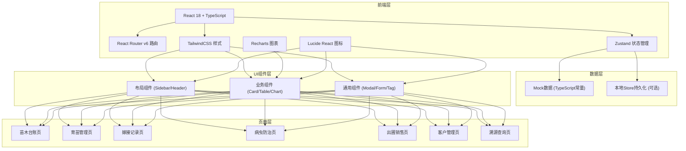

# 珍稀苗木种植基地管理系统 - 技术架构文档

## 1. 架构设计


## 2. 技术说明
- **前端**：React@18 + TypeScript@5 + Vite@5
- **样式方案**：TailwindCSS@3 + 自定义主题色变量
- **路由**：react-router-dom@6（BrowserRouter模式）
- **状态管理**：zustand@4（集中式Store）
- **图表**：recharts@2（数据可视化）
- **图标**：lucide-react@0.344
- **后端**：无后端，使用Mock数据
- **数据库**：无数据库，使用TypeScript常量定义Mock数据

## 3. 路由定义
| 路由路径 | 页面名称 | 说明 |
|---------|---------|------|
| `/` | 重定向到 `/ledger` | 默认入口 |
| `/ledger` | 苗木台账 | 品种档案、规格分级、库存统计 |
| `/seedling` | 育苗管理 | 播种批次、成活率统计、养护指导 |
| `/grafting` | 嫁接记录 | 嫁接组合、操作日志、成活分析 |
| `/pest` | 病虫防治 | 病虫害图鉴、防治排期、用药记录 |
| `/sales` | 出圃销售 | 检疫记录、工程供苗、销售台账 |
| `/customer` | 客户管理 | 客户档案、订单管理、联系记录 |
| `/trace` | 溯源查询 | 编号查询、生命周期、去向追踪 |

## 4. 数据模型
### 4.1 数据模型定义
```mermaid
erDiagram
    SPECIES ||--o{ BATCH : "包含"
    SPECIES ||--o{ INVENTORY : "对应"
    BATCH ||--o{ GRAFTING_RECORD : "可嫁接"
    BATCH ||--o{ PEST_TREATMENT : "接受"
    BATCH ||--o{ OUTBOUND : "出圃"
    CUSTOMER ||--o{ ORDER : "下单"
    ORDER ||--o{ OUTBOUND : "对应"
    INVENTORY ||--o{ TRACE_RECORD : "生成"

    SPECIES {
        string id PK
        string name 学名
        string alias 别名
        string family 科属
        string origin 产地
        string habit 生长习性
        string image 图片
    }

    BATCH {
        string id PK
        string speciesId FK
        string batchNo 批次号
        date sowingDate 播种日期
        int quantity 播种数量
        int germinated 发芽数
        int survived 成活数
        string location 位置
        string operator 负责人
    }

    GRAFTING_RECORD {
        string id PK
        string batchId FK
        string rootstock 砧木
        string scion 接穗
        string method 嫁接方法
        date operationDate 操作日期
        int quantity 数量
        int survived 成活数
        string operator 操作人员
    }

    PEST_TREATMENT {
        string id PK
        string batchId FK
        string pestName 病虫害名称
        string pesticide 农药名称
        date applyDate 施用日期
        string dosage 用量配比
        string operator 操作人员
        int safeInterval 安全间隔期
    }

    INVENTORY {
        string id PK
        string speciesId FK
        string grade 规格等级
        float dbh 地径
        float height 高度
        float crown 冠幅
        int quantity 数量
        string area 所在区域
    }

    CUSTOMER {
        string id PK
        string name 客户名称
        string type 客户类型
        string level 客户等级
        string contact 联系人
        string phone 电话
        string address 地址
    }

    ORDER {
        string id PK
        string customerId FK
        string orderNo 订单号
        date orderDate 下单日期
        float amount 订单金额
        string status 状态
    }

    OUTBOUND {
        string id PK
        string orderId FK
        string batchId FK
        string inspectionNo 检疫单号
        date outboundDate 出圃日期
        string result 检疫结果
        string certificate 证书
    }

    TRACE_RECORD {
        string id PK
        string inventoryId FK
        string traceNo 溯源编号
        json lifecycle 生命周期节点
        string destination 去向
    }
```

### 4.2 Store结构说明
使用zustand创建全局Store，包含以下切片：
- `species`：苗木品种数据
- `batches`：育苗批次数据
- `graftings`：嫁接记录数据
- `pests`：病虫防治数据
- `inventories`：库存台账数据
- `customers`：客户数据
- `orders`：订单数据
- `outbounds`：出圃记录
- `ui`：UI状态（侧边栏折叠、当前筛选等）

## 5. 目录结构
```
src/
├── components/           # 通用组件
│   ├── layout/          # 布局组件
│   │   ├── Sidebar.tsx
│   │   ├── Header.tsx
│   │   └── Layout.tsx
│   ├── ui/              # 基础UI组件
│   │   ├── Card.tsx
│   │   ├── DataTable.tsx
│   │   ├── StatCard.tsx
│   │   ├── Badge.tsx
│   │   ├── Modal.tsx
│   │   └── Tabs.tsx
│   └── charts/          # 图表组件
├── pages/               # 页面组件
│   ├── Ledger.tsx       # 苗木台账
│   ├── Seedling.tsx     # 育苗管理
│   ├── Grafting.tsx     # 嫁接记录
│   ├── PestControl.tsx  # 病虫防治
│   ├── Sales.tsx        # 出圃销售
│   ├── Customer.tsx     # 客户管理
│   └── Trace.tsx        # 溯源查询
├── store/               # 状态管理
│   └── index.ts
├── types/               # TypeScript类型定义
│   └── index.ts
├── data/                # Mock数据
│   └── mockData.ts
├── utils/               # 工具函数
│   └── formatters.ts
├── App.tsx
├── main.tsx
└── index.css
```

## 6. 样式主题配置
Tailwind配置扩展：
```js
colors: {
  forest: {
    50: '#F0F7F2', 100: '#DBE9E0', 200: '#B7D3C1',
    300: '#8BBA9B', 400: '#5D9A74', 500: '#3D7A56',
    600: '#2D5A3D', 700: '#244931', 800: '#1E3B28', 900: '#183021',
  },
  leaf: { 400: '#9CCC65', 500: '#7CB342', 600: '#558B2F' },
  earth: { 400: '#A1887F', 500: '#8D6E63', 600: '#6D4C41' },
  sand: { 50: '#F5F3EF', 100: '#ECE9E2', 200: '#DED9CF' }
}
```
